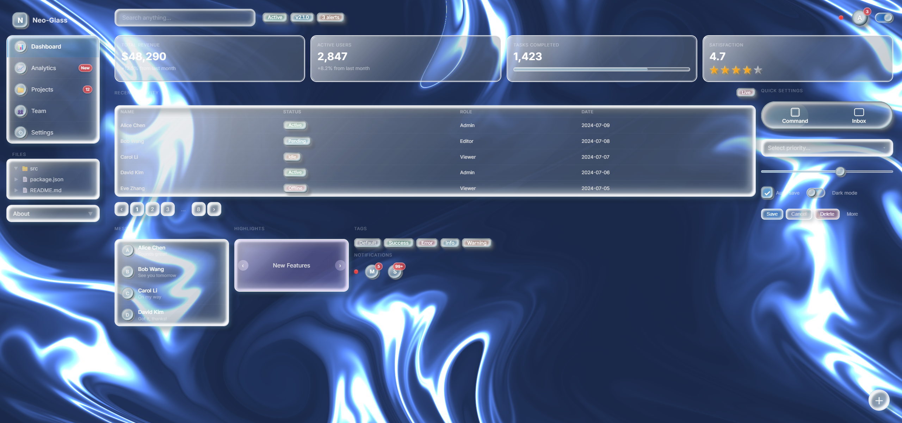
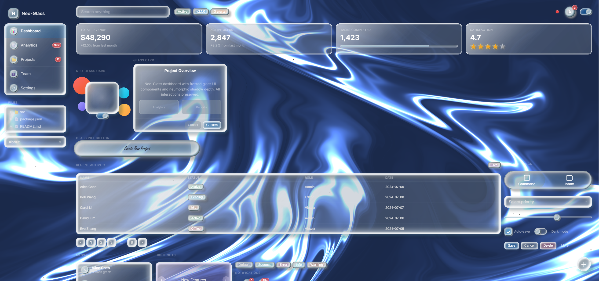
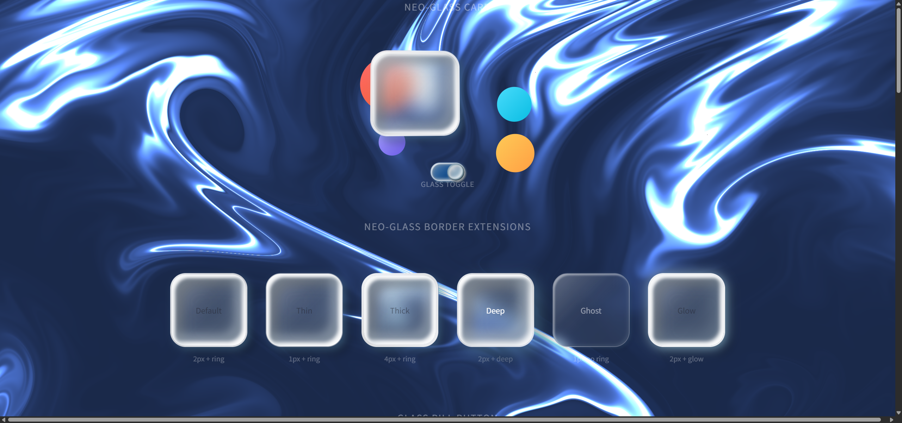

# Neo-Glass UI — 玻璃拟态深色组件库

**22+ 组件 · WebGL 着色器背景 · 3D 倾斜交互 · 零依赖 · 纯 HTML/CSS/JS**

  

---

## 立即购买

  <a href="https://ifdian.net/a/markdownpaste"><b>💰 爱发电购买 → ¥29（个人商用许可）</b></a>

---

## 组件一览

### 🎨 核心表面
`glass-base` 毛玻璃面板 · `glass-ball` 3D 玻璃球 — 均含遮罩复合描边环 + 光泽叠加伪元素

### 🔘 按钮
**玻璃胶囊按钮**（Romanesco 字体 + 3D 透视倾斜）· **玻璃按钮**（主色 / 危险 / 文字 / 小 / 大）

### 📝 表单控件
文本输入 · 复选框 · 开关 · 滑块 · 下拉选择器 · 分段控制器 · 评分星级 · 进度条

### 📊 数据展示
表格 · 列表 · 树形控件 · 分页器

### 🧭 导航与容器
导航菜单 · 折叠面板 · 轮播 · 玻璃卡片（三栏式）

### 💬 反馈与装饰
悬浮按钮 · 标签（5 色）· 徽章（圆点/计数）· 头像

---

## 演示文件

| 文件 | 说明 |
|------|------|
| `neo-glass-dashboard.html` | 完整后台面板（22组件 + 侧边栏 + WebGL） |
| `neo-glass-ui-kit.html` | 组件目录（60+ 变体） |
| `demo-reference.html` | 原始 Figma 参考实现 |

---

## 核心特性

| 特性 | 说明 |
|------|------|
| **9 层新拟态阴影** | 2 层外层 + 7 层内层，精确定向光源（左上→右下） |
| **遮罩复合描边环** | `mask-composite: exclude` 跟随任意圆角 |
| **3D 透视倾斜** | CSS 自定义属性驱动，弹簧缓动回弹 |
| **玻璃球悬停物理** | `scale(1.15)` + 11 层阴影增强 |
| **水纹焦散纹理** | SVG `feTurbulence` 数据 URI，`soft-light` 混合 |
| **WebGL 流动波浪** | 全屏着色器背景，鼠标交互，天蓝色调 |
| **零依赖** | 无框架、无构建工具，浏览器直接打开 |

---

## 快速开始

1. 引入字体：Inter + Romanesco（Google Fonts CDN）
2. 添加 `<canvas id="shader-bg">` 作为 WebGL 背景
3. 复制需要的组件 HTML + CSS 代码即可使用

详细文档请参考购买后附赠的 `SKILL-NEO-GLASS-DASHBOARD.md`。

---

## 技术规格

| 项目 | 说明 |
|------|------|
| 语言 | HTML + CSS + JavaScript（原生） |
| 依赖 | 零（仅 Google Fonts CDN） |
| 浏览器 | Chrome / Edge / Safari / Firefox |
| 文件大小 | ~88KB 每个演示文件（自包含） |

---

## 购买

| 版本 | 价格 | 内容 |
|------|------|------|
| **个人版** | ¥29 | 3 HTML 演示 + 5 设计文档 + 个人商用许可 |

**[👉 立即购买（爱发电）](https://ifdian.net/a/markdownpaste)**

---

  
  

  &copy; 2026 Neo-Glass UI. 保留所有权利。

